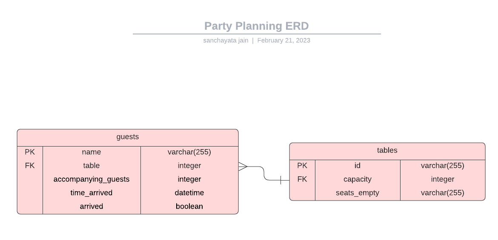

## Summary

Welcome to the Party Planning REST API project! This is a simple REST API for managing party planning tasks. 
The tasks:
- Creating tables
- Adding people to the guest list
- Managing the guest list
- Deleting guests from the guest list
- Calculating total number of empty seats in the venue at any point


## Instructions to run:
Start docker container:
```
docker compose up -d
```

Make app:
```
make run-api
```

Stop docker container:
```
docker compose down
```

## ERD 


## Endpoints
### Add table

```
POST /tables
body: 
{
    "capacity": 10
}
response: 
{
    "id": 2,
    "capacity": 10
}
```

### Add a guest to the guestlist

```
POST /guest_list/name
body: 
{
    "table": int,
    "accompanying_guests": int
}
response: 
{
    "name": "string"
}
```

### Get the guest list

```
GET /guest_list
response: 
{
    "guests": [
        {
            "name": "string",
            "table": int,
            "accompanying_guests": int
        }, ...
    ]
}
```

### Guest Arrives

```
PUT /guests/name
body:
{
    "accompanying_guests": int
}
response:
{
    "name": "string"
}
```

### Guest Leaves

When a guest leaves, all their accompanying guests leave as well.

```
DELETE /guests/name
response code: 204
```

### Get arrived guests

```
GET /guests
response: 
{
    "guests": [
        {
            "name": "string",
            "accompanying_guests": int,
            "time_arrived": "string"
        }
    ]
}
```

### Count number of empty seats

```
GET /seats_empty
response:
{
    "seats_empty": int
}
```